# 🏛️ Arquitetura do Projeto — Ingestão no Limite

Este documento descreve a arquitetura do sistema de avaliação da competição **Ingestão no Limite**: componentes, fluxos, responsabilidades e como uma submissão percorre o pipeline do PR até o ranking.

Documentos relacionados:

| Documento | Conteúdo |
| :--- | :--- |
| [REGRAS_E_CONTRATO.md](./REGRAS_E_CONTRATO.md) | Schema, filtros B2B, data quality |
| [STACK_E_LIMITES.md](./STACK_E_LIMITES.md) | Variáveis de ambiente, limites de hardware |
| [GATES_E_RANKING.md](./GATES_E_RANKING.md) | Gates, status, critérios de ranking |
| [CHECKLIST_PR.md](./CHECKLIST_PR.md) | Checklist para participantes |

---

## 1. Visão geral

A competição separa claramente **dois mundos**:

1. **Mundo do participante** — repositório público com `Dockerfile` e pipeline de ingestão.
2. **Mundo do organizador** — servidor self-hosted (Celeron) que orquestra builds, executa containers isolados e valida resultados.

O repositório `ingestao_no_limite` é o **hub da competição**: recebe submissões via PR, dispara o avaliador e publica resultados no ranking.

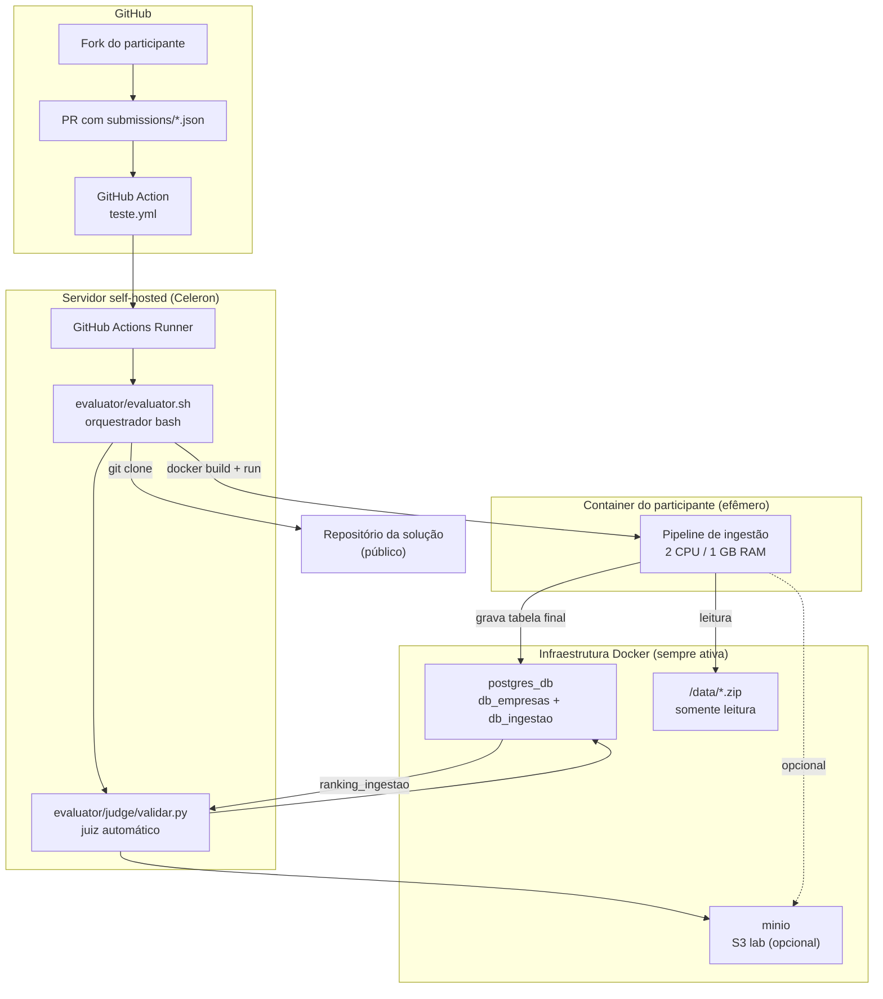

---

## 2. Princípios de arquitetura

| Princípio | Como é aplicado |
| :--- | :--- |
| **Orquestrador fino** | `evaluator/evaluator.sh` só clona, builda, roda Docker e delega validação ao juiz |
| **Juiz com regras** | `validar.py` concentra gates SQL, métricas e INSERT no ranking |
| **Isolamento** | Cada submissão roda em container efêmero com limites rígidos de CPU/RAM |
| **Fila única** | Uma avaliação por vez; cooldown de 15 min entre runs |
| **Segredos fora do repo** | SQL dos gates e `config.env` ficam no servidor, não no GitHub público |
| **Fail-fast** | Preflight verifica Postgres antes de clone/build |

---

## 3. Componentes

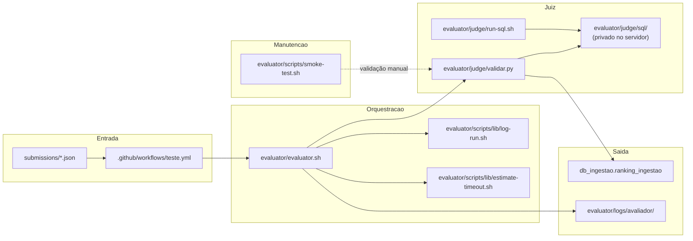

### 3.1 `evaluator/evaluator.sh` — orquestrador

Responsabilidades:

- Validar toolchain (`jq`, `git`, `docker`, `python3`)
- Preparar venv Python do juiz (`evaluator/judge/.venv` — `psycopg2`, `boto3`)
- Verificar se `postgres_db` está rodando
- Ler e validar JSON de submissão
- Chamar preflight do juiz (Gate G1)
- `git clone --depth 1` do repositório do participante
- `docker build` com timeout de 15 min
- `docker run` com 2 CPU / 1 GB RAM (sem swap)
- Medir wall time e pico de RAM via `docker stats`
- Limpar container e imagem após execução
- Delegar gates G2–G4 e ranking ao juiz

**Não faz:** queries de data quality, regras de negócio ou ranking — isso é do juiz.

### 3.2 `evaluator/judge/validar.py` — juiz automático

Três comandos principais:

| Comando | Quando | Função |
| :--- | :--- | :--- |
| `preflight` | Antes do build | Testa conectividade com `db_empresas` |
| `registrar` | Falha antecipada | Grava status de erro no ranking |
| `avaliar` | Após `docker run` | Gates G2–G4, métricas, INSERT ranking |

Dependências Python: `psycopg2-binary`, `boto3` (instaladas automaticamente em `evaluator/judge/.venv` pelo `evaluator/evaluator.sh`).

### 3.3 GitHub Action — `teste.yml`

| Aspecto | Comportamento |
| :--- | :--- |
| Trigger | **Merge** na `main` alterando `submissions/*.json` (`push`) |
| Reavaliação manual | `workflow_dispatch` com caminho do JSON (ex.: `submissions/dataforma-hub.json`) |
| Runner | `self-hosted` (servidor local) |
| Concurrency | `avaliador-ingestao` — fila única, sem cancelar em andamento |
| Cooldown | 15 min (`COOLDOWN_SEC`) após cada avaliação |

### 3.4 Infraestrutura compartilhada

Serviços **sempre ativos** no host (não sobem por submissão):

| Serviço | Container | Bancos / paths |
| :--- | :--- | :--- |
| PostgreSQL | `postgres_db` | `db_empresas` (dados), `db_ingestao` (ranking) |
| MinIO (S3 lab) | `minio` | bucket `marketing-leads` — alvo S3 local para benchmark; não é recomendação de produção |
| Dados brutos | volume montado | `/data/*.zip` (read-only) |

> **Licença:** o MinIO na infra de avaliação é componente interno de laboratório (AGPLv3 + [MinIO Software License](https://docs.min.io/license/) para binários). Participantes devem abstrair a API S3 no código; para produção ou replicação do desafio, use backends S3-compatíveis à escolha de cada time. Detalhes em [STACK_E_LIMITES.md](./STACK_E_LIMITES.md#-object-storage-s3-compatível-opcional).

---

## 4. Rede Docker na avaliação

Todos os containers relevantes compartilham a mesma rede Docker (`DOCKER_NETWORK` em `evaluator/judge/config.env`).

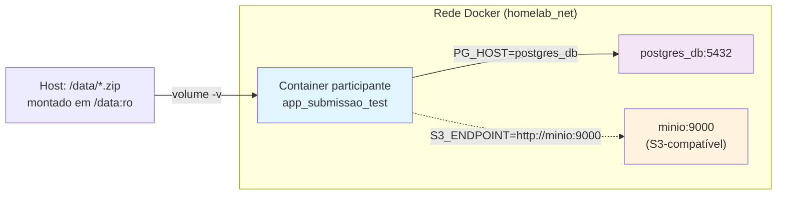

Variáveis injetadas no container do participante estão documentadas em [STACK_E_LIMITES.md](./STACK_E_LIMITES.md).

---

## 5. Fluxo de uma submissão (workflow completo)

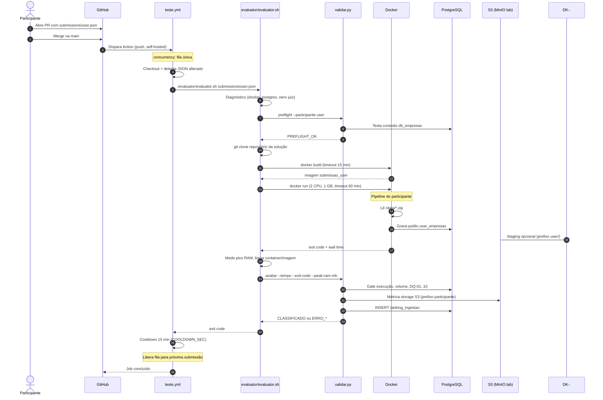

---

## 6. Gates de validação

Gates são **binários**: falhou um = não classificado.

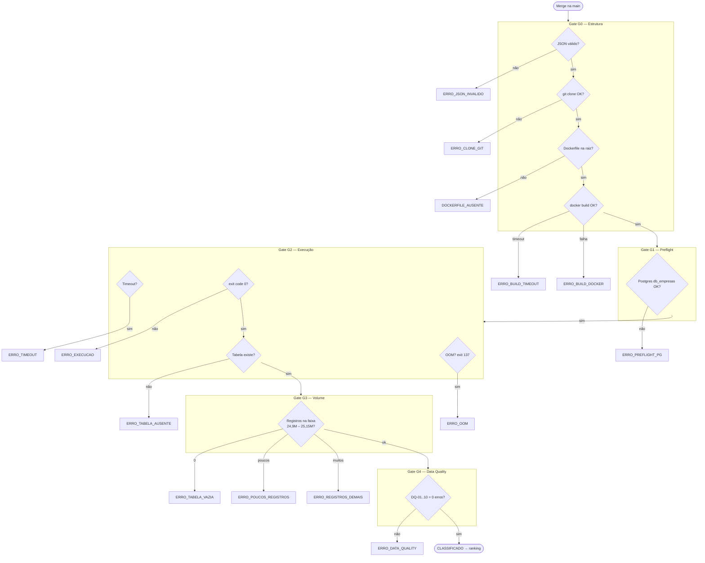

| Gate | Responsável | Onde roda |
| :--- | :--- | :--- |
| G0 | `evaluator/evaluator.sh` | Bash + Docker |
| G1 | `validar.py preflight` | Python |
| G2 (execução) | `evaluator/evaluator.sh` + `validar.py` | Bash mede; Python valida |
| G3 (volume) | `validar.py` + SQL | Python |
| G4 (DQ) | `validar.py` + SQL | Python |

---

## 7. Fluxo de dados

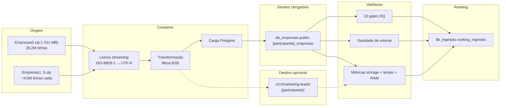

**Perfil do dataset oficial (medido — ver [PERFIL_DATASET.md](./PERFIL_DATASET.md)):**

| Métrica | Valor real |
| :--- | :--- |
| Arquivos `.zip` | 10 |
| Tamanho comprimido | ~1,26 GB |
| Total descompactado | **~5,0 GB** (compressão 4,0x) |
| Arquivo 1 (`Empresas0.zip`) — linhas | **28.175.408** (~2,1 GB) |
| Arquivos 2–10 — linhas cada | **4.494.860** cada |
| **Total de linhas a processar** | **68.629.148** |
| Colunas origem + derivadas | **7 + 3** (regras de negócio) |
| Registros finais (após filtros) | **25.031.418** (faixa apertada 24,9M – 25,15M) |

---

## 8. Fila e fairness

O workflow garante que submissões **nunca corram em paralelo** e que haja um intervalo entre elas.

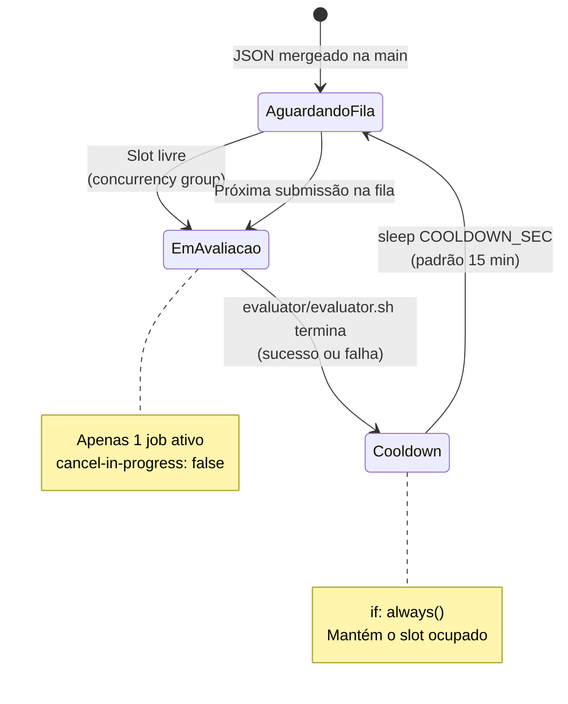

| Regra | Implementação |
| :--- | :--- |
| Fila única | `concurrency.group: avaliador-ingestao` |
| Não cancelar em andamento | `cancel-in-progress: false` |
| Intervalo entre runs | Step `Intervalo de cortesia` com `sleep 900` |
| Configurável | Variável de repo `COOLDOWN_SEC` no GitHub |

---

## 9. Limites de recursos

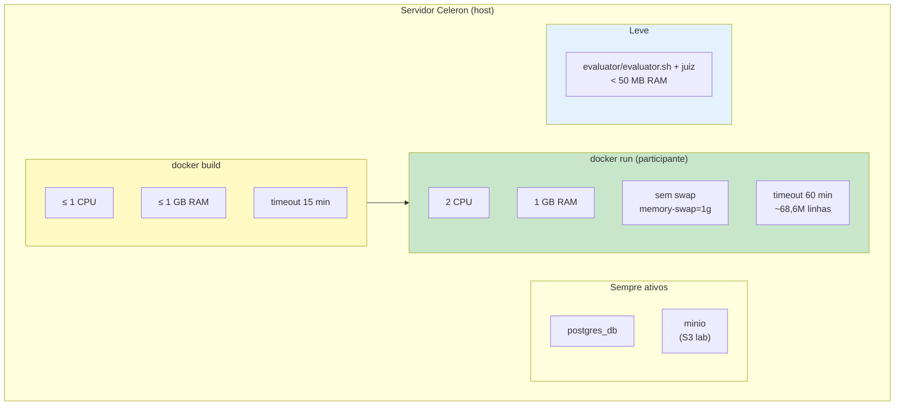

O timeout do pipeline é um **orçamento fixo de 60 min (3600 s)** — restritivo por design. Com **68.629.148 linhas** a processar (28,2M + 9×4,5M), isso exige **~19.000 linhas/s sustentadas** em 2 CPU / 1 GB RAM. O cálculo está em `evaluator/scripts/lib/estimate-timeout.sh`. Detalhes em [STACK_E_LIMITES.md](./STACK_E_LIMITES.md).

---

## 10. Estrutura de diretórios

```
ingestao_no_limite/
├── .github/workflows/
│   └── teste.yml              # CI: dispara avaliação após merge (push + dispatch manual)
├── docs/
│   ├── ARCHITECTURE.md        # Este documento
│   ├── REGRAS_E_CONTRATO.md
│   ├── STACK_E_LIMITES.md
│   ├── GATES_E_RANKING.md
│   └── CHECKLIST_PR.md
├── submissions/
│   └── *.json                 # Metadados (participante + repo + email opcional)
├── submitter/                 # Starter — copiar para o repo do participante
│   ├── Dockerfile
│   ├── requirements.txt
│   ├── participante.json.example
│   └── src/
└── evaluator/                 # Tooling do servidor (organizadores)
    ├── evaluator.sh           # Orquestrador principal
    ├── judge/
    │   ├── validar.py         # Judge automático (gates + ranking)
    │   ├── run-sql.sh         # Executor SQL (organizador)
    │   ├── config.env.example
    │   ├── requirements.txt
    │   └── sql/               # Gates e métricas (privado — .gitignore)
    ├── scripts/
    │   ├── smoke-test.sh
    │   └── lib/
    │       ├── log-run.sh
    │       └── estimate-timeout.sh
    └── logs/                  # Saída de execuções (.gitignore)
        ├── avaliador/
        ├── smoke-test/
        └── run-sql/
```

---

## 11. Separação público vs privado

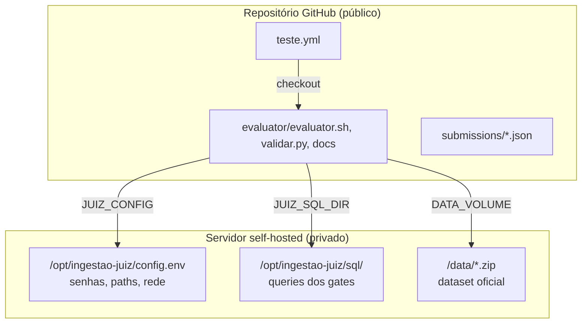

Competidores **não** têm acesso SSH ao servidor. A avaliação roda automaticamente após o merge na `main` (ou via disparo manual do organizador).

---

## 12. Smoke test (organizador)

O `evaluator/scripts/smoke-test.sh` **não** roda automaticamente em cada submissão. É uma ferramenta de manutenção para validar a infra antes de abrir a fila.

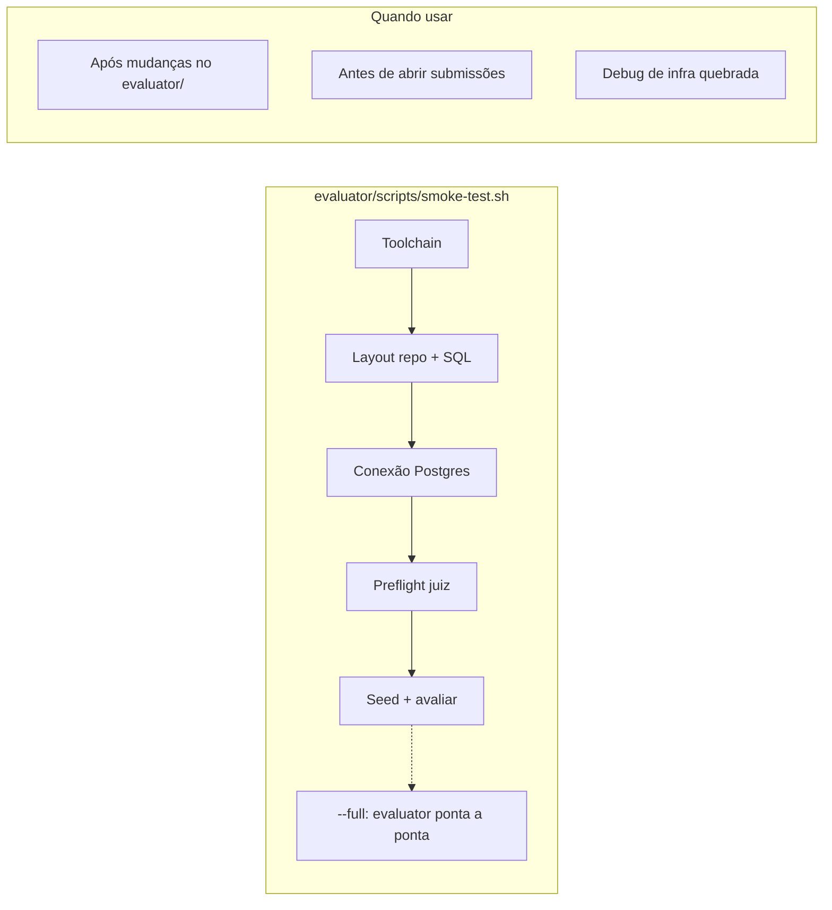

Em cada submissão real, apenas o **preflight** do juiz roda antes do build — equivalente ao Gate G1, sem o overhead do smoke completo.

---

## 13. Ranking

Soluções **classificadas** entram no ranking pelo **score composto** (menor vence) — não é mais só velocidade:

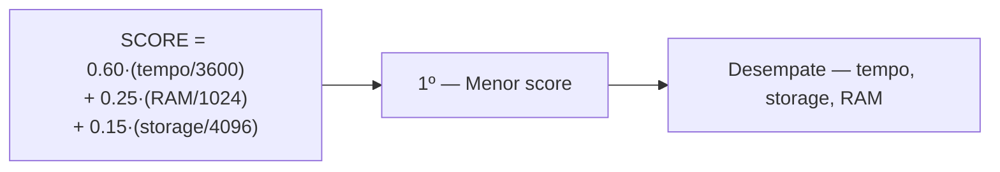

Recompensa eficiência holística (tempo + RAM + storage). Dados gravados em `db_ingestao.public.ranking_ingestao` (coluna `score`). Detalhes e pesos em [GATES_E_RANKING.md](./GATES_E_RANKING.md). Views para o site: `v_leaderboard`, `v_melhor_por_participante`, `v_ultima_avaliacao`.

---

## 14. Resumo executivo

| Pergunta | Resposta |
| :--- | :--- |
| O que dispara a avaliação? | Merge na `main` (`push` em `submissions/*.json`) ou `workflow_dispatch` manual |
| Quem orquestra? | `evaluator/evaluator.sh` no runner self-hosted |
| Quem valida regras? | `evaluator/judge/validar.py` + SQL privado |
| Onde o participante grava dados? | `db_empresas.public.{participante}_empresas` |
| Quantas avaliações em paralelo? | **1** (fila única) |
| Intervalo entre submissões? | **15 min** de cooldown |
| Limites do container? | 2 CPU, 1 GB RAM, 60 min timeout (~68,6M linhas) |
| O smoke test roda em cada submissão? | **Não** — só preflight + pipeline real |
